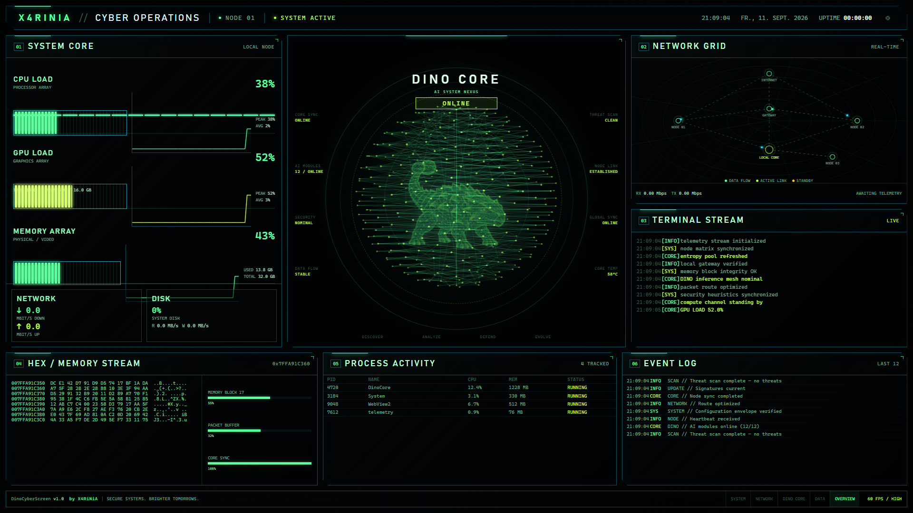

# DinoCyberScreen

**DinoCyberScreen** is a modern, sci-fi cyber operations Windows screensaver created by **X4RiNiA**. It transforms your idle displays into a futuristic command center featuring real-time system telemetry, holographic dinosaur core specimens, and customizable color themes.

---

## Features

- **5 Holographic Core Specimens:** Choose between **Ankylosaurus (ANKYLO CORE)**, **Triceratops (TRICERA CORE)**, **Velociraptor (VELO CORE)**, **Stegosaurus (STEGO CORE)**, and **Pterodactylus (PTERO CORE)** as your central 3D wireframe hologram display.
- **5 Custom Color Profiles:** Select from 5 curated Cyberpunk color themes:
  - **Blue:** Electric Cyan & Deep Cobalt Blue
  - **Green:** Matrix Green & Lime/Yellow-Green
  - **Red:** Cyber Red & Neon Orange
  - **White:** Platinum White & Cool Sky Blue
  - **Pink:** Cyber Magenta & Hot Pink / Rose
- **Personalized System Name:** Customize the HUD header text to display your own custom handle or system callsign (defaults to `DINO` if left blank).
- **Single & Dual Monitor Support (1 or 2 Displays):**
  - **2 Displays:** Displays the dedicated Holographic Dino Core on your secondary monitor and the Cyber Operations Dashboard on your primary monitor.
  - **1 Display:** Combines all telemetry metrics and the Holographic Core into a unified HUD overview layout.
- **Telemetry Options:** Supports real hardware monitoring (CPU, GPU, RAM, Disk, Network) or simulated telemetry data.
- **Visual Events & Slow Scanlines:** Random sci-fi anomaly alerts and smooth, slow horizontal scanline sweeps across the Dino Core screen.
- **Power Management Protection:** Integrates display sleep prevention to ensure continuous playback without black screens.

---

## Installation

Installing DinoCyberScreen is quick and simple:

1. Download or locate the **`release`** folder.
2. Double-click **`Install-Screensaver.bat`**.
3. Click **Yes** if Windows requests Administrator permissions (required to copy `.scr` files to `C:\Windows\System32`).
4. Windows Screensaver Settings will open automatically with **DinoCyberScreen** selected.

---

## Configuration

To customize DinoCyberScreen settings:

1. Click **Settings / Einstellungen** in your Windows Screen Saver dialog or launch `DinoCyberScreen.exe`.
2. Configure your preferred **Dino Specimen** (Ankylosaurus, Triceratops, Velociraptor, Stegosaurus, Pterodactylus), **Theme Color** (Blue, Green, Red, White, Pink), **Personalized Name**, **Monitor Mode**, and **Telemetry Options**.
3. Click **SPEICHERN** to save your profile.

---

## Uninstallation

To completely remove DinoCyberScreen:

1. Open the **`release`** folder.
2. Double-click **`Uninstall-Screensaver.bat`**.
3. The screensaver will be cleanly removed from your Windows system.

---
*Created by **X4RiNiA** — Secure Systems. Brighter Tomorrows.*
